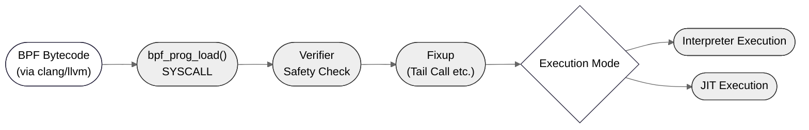
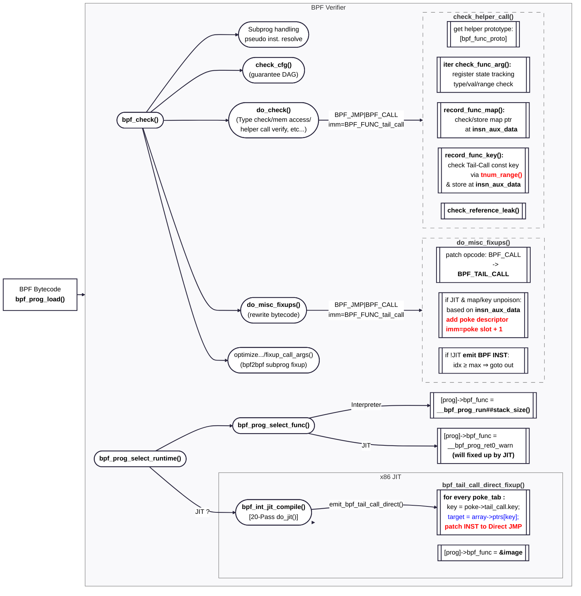

# Abnormal Behavior of BPF Program in JIT Mode

## Summary

This report investigates an out-of-bounds access bug in Linux Kernel v5.15 that occurs when loading a specific BPF program with JIT enabled.

**Issue**: BPF program with out-of-bounds tail call key (111) exceeds map size (100) but passes verifier validation

**Key Discoveries:**
1. **Reproduction**: KASAN detects slab-out-of-bounds in `bpf_tail_call_direct_fixup()` when loading BPF program with JIT (Section 1)
2. **Introduced**: Commit [d2e4c1e6c294] (v5.5-rc1) - "bpf: Constant map key tracking for prog array pokes" (Section 5)
3. **Fixed**: Commit [a657182a5c51] (v6.0-rc4) - "bpf: Don't use tnum_range on array range checking for poke descriptors" (Section 5)
4. **Verification**: KASAN resolved by verifier bounds fix, causing JIT to use indirect instead of direct tail-call (Section 5)

**Additional Analysis:**
- **Root Cause**: `tnum_range()` creates over-approximation (0-127 instead of 0-99), allowing invalid key to pass verification (Section 3)
- **Impact**: Only affects JIT direct tail-call mode. Interpreter and JIT indirect tail-call has runtime bounds checking (Section 4)
- **Prevention**: Proposes strategy to prevent JIT's blind trust in verifier validation (Section 6)
  - JIT-time bound validation with `CONFIG_BPF_JIT_PARANOID` option
  - Runtime bounds check emission (with performance trade-offs)
  - Regression tests for tnum precision boundary cases (BPF Kselftests)

## 1. Problem Statement and Reproduction

In Kernel version v5.15, a specific BPF program triggers unexpected behavior when executed in JIT mode, while the same program runs correctly in interpreter mode. This issue does not occur in latest kernel versions, where the program behaves correctly in both modes.

> **Note**: The kernel code (v5.15) shown in this document is simplified for clarity.   
> Irrelevant or non-essential lines are omitted to focus on core logic.

The problematic BPF program is located at [bpf/out_bound.bpf.c](bpf/out_bound.bpf.c):
```c
// bpf/out_bound.bpf.c
#include <linux/types.h>
#include <bpf/bpf_helpers.h>

char LICENSE[] SEC("license") = "GPL";

struct {
    __uint(type, 3 /* BPF_MAP_TYPE_PROG_ARRAY */);
    __type(key, __u32);
    __type(value, __u32);
    __uint(max_entries, 100);
} progs SEC(".maps");

SEC("tp/syscalls/sys_enter_write")
int tp_outbound(void *ctx) {
    __u32 key = 111;  // Out of bounds! max_entries = 100
    bpf_tail_call(ctx, &progs, key);
    return 0;
}
```

Here `key = 111` exceeds `max_entries = 100`, yet this only causes problems in JIT mode.

### Steps to Reproduce

To reproduce the issue, use the scripts included in this repository by running the following commands:
```bash
# If not Ubuntu, use privileged ubuntu:24.04 Docker (mount this repo to /git)
# docker run --privileged --volume $PWD:/git -it ubuntu:24.04

./run.sh setup v5.15     # Prepare kernel v5.15 worktree
./run.sh build v5.15     # Build kernel and modules
./run.sh rootfs          # Create minimal openSUSE rootfs
./run.sh inject v5.15    # Build test BPF prog and inject with custom init
./run.sh qemu v5.15      # Run QEMU with KASAN-enabled kernel
```

This sets up a minimal environment of kernel 5.15 (openSUSE) to reproduce the issue by loading the faulty BPF program. (see [Appendix B](#appendix-B-lab-environment-reference))

Upon QEMU boot, `bpftool` attempts to load the BPF program, triggering the following KASAN slab-out-of-bounds report:
```bash
# cat ./src/v5.15/log-8bb7eca972ad
BUG: KASAN: slab-out-of-bounds in bpf_int_jit_compile+0x701/0x8e0
Read of size 8 at addr ffff88800806b508 by task bpftool/87

Call Trace:
 dump_stack_lvl+0x49/0x5e
 print_address_description.constprop.0+0x28/0x1c0
 kasan_report.cold+0x78/0x119
 __asan_load8+0x8a/0xa0
 bpf_int_jit_compile+0x701/0x8e0
 ...
```

Decoding the stack trace using `./scripts/decode_stacktrace.sh` reveals the suspected location of the error:
```bash
# cd ./src/v5.15
# ./scripts/decode_stacktrace.sh vmlinux . < log-8bb7eca972ad
BUG: KASAN: slab-out-of-bounds in bpf_int_jit_compile (./arch/x86/net/bpf_jit_comp.c:583 ./arch/x86/net/bpf_jit_comp.c:2367)
Read of size 8 at addr ffff88800806b508 by task bpftool/87
```

This line points to the exact location of the bug in `bpf_tail_call_direct_fixup()`, which will be covered in [Section 4](#the-crash-in-bpf_tail_call_direct_fixup). While we could jump there to see the root cause immediately, let’s first walk through the surrounding context in the next sections to build a clearer understanding.

## 2. BPF Program Execution Pipeline

### Overview

The BPF execution pipeline goes through the following stages:



- **Loading**: Loading bytecode into the kernel via syscall
- **Verification**: Performing safety checks and validation
- **Fixup**: Transforming bytecode for efficient execution (e.g., tail calls)
- **Execution**: Running the program either through interpretation or JIT compilation

### Instruction Format

BPF instructions are 64-bit wide:
```
| code (8 bits) | dst_reg(4) | src_reg(4) | offset(16) | immediate(32) |
```

Our BPF program contains the following instruction:

```shell
# llvm-objdump -S --no-show-raw-insn ./bpf/out_bound.bpf.o
0000000000000000 <tp_outbound>:
;   bpf_tail_call(ctx, &progs, key);
0:  18 02 00 00 00 00 00 00 ...     r2 = 0x0             BPF_LD_IMM64(BPF_REG_2, 0x0)   // libbpf replaces 0 with map fd
2:  b4 03 00 00 6f 00 00 00         w3 = 0x6f (111)      BPF_MOV32_IMM(BPF_REG_3, 0x6f)
3:  85 00 00 00 0c 00 00 00         call 0xc   (12)      BPF_RAW_INSN(BPF_JMP | BPF_CALL, 0, 0, 0, BPF_FUNC_tail_call)
;   return 0;
4:  b4 00 00 00 00 00 00 00         w0 = 0x0             BPF_MOV32_IMM(BPF_REG_0, 0x0)
5:  95 00 00 00 00 00 00 00         exit                 BPF_EXIT_INSN()
```

Our particular interest is instruction 3: `call 0xc` (`code=0x85`, `imm=12`)

As a tail call, it is transformed during the pipeline as follows:
- **After compilation**: `code=BPF_JMP|BPF_CALL (0x85)`, `imm=BPF_FUNC_tail_call (12)`
- **After verifier fixup**: `code=BPF_JMP|BPF_TAIL_CALL (0xfd)`, `imm=poke_index+1` (JIT only)

### Verification and Execution Flow

The BPF program goes through multiple stages in the kernel:


_Note: **Red** marks buggy paths; **Blue** marks the exact out-of-bounds access._

The BPF program goes through the following stages:
- **Loading**
  - `bpf_prog_load()`: Loads the BPF bytecode into the kernel and triggers verification

- **Verification** – `bpf_check()`
  1. Initializes verifier state, processes subprograms, and resolves pseudo instructions
  2. `check_cfg()`: Ensures control flow is acyclic and all paths terminate (DAG)
  3. `do_check()`: Performs static analysis including type checks, memory access validation, and helper call verification

- **Fixup**
  1. `do_misc_fixups()`: Rewrites certain bytecode (e.g., helper calls) for efficient execution and records auxiliary data for later stages
  2. `fixup_call_args()`: Validates and adjusts bpf-to-bpf calls and related features

- **Execution**
  1. `bpf_prog_select_runtime()`: Chooses between interpreter and JIT mode, assigning the appropriate entry point
  2. `bpf_int_jit_compile()`: Runs a multi-pass compiler to emit native code. Finalizes tail call optimizations through direct jump patching

## 3. Deep Dive: The Verifier Bug

### The do_check() Function

The verifier walks through each instruction and applies validation checks:
```c
// kernel/bpf/verifier.c:10863
static int do_check(struct bpf_verifier_env *env) {
    for (;;) {
        struct bpf_insn *insn = &insns[env->insn_idx];
        struct bpf_reg_state *regs = cur_regs(env);
        u8 class = BPF_CLASS(insn->code);

        // Tail call: code=BPF_JMP|BPF_CALL, imm=BPF_FUNC_tail_call
        if (class == BPF_ALU || class == BPF_ALU64) {
            ...
        } else if (class == BPF_JMP || class == BPF_JMP32) {
            u8 opcode = BPF_OP(insn->code);
            if (opcode == BPF_CALL) {
                ...
                if (insn->src_reg == BPF_PSEUDO_CALL)
                    ...
                else
                    err = check_helper_call(env, insn, &env->insn_idx);
            }
        }
        env->insn_idx++;
    }
}
```

When the verifier encounters a helper call like `bpf_tail_call(ctx, &progs, key)`, it delegates to `check_helper_call()` to validate the call and its arguments.

At this point, the call is associated with the following register assignments:
- `R1`: context pointer
- `R2`: map pointer to `progs`
- `R3`: constant key `111`

Note that these assignments do not represent actual runtime values. Instead, they reflect the verifier’s **statically tracked register state**, which records each register’s **type** (e.g., pointer, scalar) and, when possible, its **value range** or **constant**. (see [Appendix A](#appendix-a-register-state-value-tracking) for details)

For example, upon seeing `w3 = 111` (`code=BPF_ALU|BPF_MOV`, `imm=0x6f(111)`) the verifier marks:
- `R3` is of type `SCALAR_VALUE`
- its value is known constant `111`

This information is later used to ensure helper call arguments are valid and type-safe.

### Inside check_helper_call()

This function validates helper calls through a following step:
```c
// kernel/bpf/verifier.c:6169
static int check_helper_call(struct bpf_verifier_env *env, struct bpf_insn *insn, int *insn_idx_p) {
    struct bpf_call_arg_meta meta = {};  // helper argument metadata for fixup
    const struct bpf_func_proto *fn;
    int func_id = insn->imm;

    // Get helper function prototype
    fn = env->ops->get_func_proto(func_id, env->prog);
    ...
    // Validate arguments against prototype
    for (i = 0; i < MAX_BPF_FUNC_REG_ARGS; i++) {
        err = check_func_arg(env, i, &meta, fn);
    }
    ...
    // Record map and key information for JIT fixup
    err = record_func_map(env, &meta, func_id, insn_idx);
    err = record_func_key(env, &meta, func_id, insn_idx);  // BUG HERE
    ...
}
```

The function performs three key steps:

1. **Retrieve prototype**: For `bpf_tail_call()`, expected prototype is:
```c
// kernel/bpf/core.c:2377
const struct bpf_func_proto bpf_tail_call_proto = {
    .arg1_type  = ARG_PTR_TO_CTX,
    .arg2_type  = ARG_CONST_MAP_PTR,
    .arg3_type  = ARG_ANYTHING,
    ...
};
```

2. **Argument Validation**: `check_func_arg()` validates that:
- `R1` is a valid context pointer
- `R2` points to a `BPF_MAP_TYPE_PROG_ARRAY`
- `R3` is a scalar value (our constant 111)

3. **Auxilary data Recording**: verifier records information needed for later fixup (especially JIT)
- `record_func_map()`: stores the map pointer `R2` into `insn_aux_data[]`
- `record_func_key()`: **Should** only store constant keys `R3` for tail_call access
- `insn_aux_data[]` tracks per-instruction metadata used throughout verification and fixup

The bug occurs in the final step where `record_func_key()` fails to properly validate the key against the map's bounds.

### The Buggy record_func_key()

The core bug lies in how `record_func_key()` validates the key value:
```c
// kernel/bpf/verifier.c:6059
static int record_func_key(struct bpf_verifier_env *env,
                          struct bpf_call_arg_meta *meta,
                          int func_id, int insn_idx) {
    struct bpf_insn_aux_data *aux = &env->insn_aux_data[insn_idx];
    struct bpf_reg_state *reg = &regs[BPF_REG_3];  // R3 = 111
    struct bpf_map *map = meta->map_ptr;           // max_entries = 100

    // THE BUG: tnum_range creates over approximation
    struct tnum range = tnum_range(0, map->max_entries - 1);

    if (!register_is_const(reg) || !tnum_in(range, reg->var_off)) {
        bpf_map_key_store(aux, BPF_MAP_KEY_POISON);
        return 0;
    }

    // Bug: This executes even though 111 > 99
    val = reg->var_off.value;
    bpf_map_key_store(aux, val);  // Stores 111 as "valid"
}
```

The function uses `tnum_range()` to represent a value range, but this results in an overapproximation that includes values outside the actual bounds. As a result, it should have rejected the key 111 for exceeding the map’s max_entries of 100, but the imprecise result allowed the validation to pass incorrectly.

### Understanding tnum (Tristate Numbers)

The verifier uses tristate numbers to track possible values of registers. This is necessary because not all values are known at verification time (see [Appendix A](#a2-tnum-representation) for implementation details).

A tnum represents a set of possible values:
```c
struct tnum {
    u64 value;  // Bits known to be 1
    u64 mask;   // Bits that are unknown (could be 0 or 1)
};
```

For `tnum_range(0, 99)`:
- We need to represent all values from 0 to 99
- 99 in binary is 0110_0011 (uses up to bit 6)
- The tnum mechanism creates a mask covering all possible values up to bit 6
- This results in `{value=0, mask=0x7F}` which represents 0-127, not 0-99

Since 111 (0110_1111) fits within the mask 0x7F, it's incorrectly considered valid.

### How do_misc_fixups() Transforms the Program

After verification passes, the bytecode is rewritten for efficient execution:

```c
// kernel/bpf/verifier.c:12639
static int do_misc_fixups(struct bpf_verifier_env *env) {
	struct bpf_insn_aux_data *aux;
    ...
    for (i = 0; i < insn_cnt; i++, insn++) {
        if (insn->code == (BPF_JMP | BPF_CALL) &&
            insn->imm == BPF_FUNC_tail_call) {
            aux = &env->insn_aux_data[i];

            // 1. Change opcode for interpreter
            insn->code = BPF_JMP | BPF_TAIL_CALL;
            insn->imm = 0;

            // 2. For JIT: if key was validated as constant
            if (... && prog->jit_requested &&
	        !bpf_map_key_poisoned(aux) &&
		!bpf_map_ptr_poisoned(aux)) {
                // Create JIT poke(patch) descriptor
                struct bpf_jit_poke_descriptor desc = {
                    .reason = BPF_POKE_REASON_TAIL_CALL,
                    .tail_call.map = aux->map_ptr_state.map_ptr,
                    .tail_call.key = bpf_map_key_immediate(aux),  // Our buggy key!
                    .insn_idx = i,
                };

                ret = bpf_jit_add_poke_descriptor(env->prog, &desc);
                insn->imm = ret + 1;  // Store poke table slot index
            }
        }
    }
}
```

The fixup phase serves two purposes:
1. **For interpreter**: Changes the opcode from generic `BPF_CALL` to specialized `BPF_TAIL_CALL` for faster dispatch
2. **For JIT**: If the key is constant and map pointer is "valid", creates a poke descriptor to enable direct jump optimization

The poke descriptor contains all information needed to patch a direct jump at JIT time, avoiding the overhead of runtime map lookups.

## 4. Execution Modes: Why Only JIT Crashes

### Interpreter Mode (Safe)

The interpreter executes BPF instructions in a virtual machine with full safety checks:

```c
// kernel/bpf/core.c:1375
static u64 ___bpf_prog_run(u64 *regs, const struct bpf_insn *insn) {
    static const void * const jumptable[256] __annotate_jump_table = {
        BPF_INSN_MAP(BPF_INSN_2_LBL, BPF_INSN_3_LBL),
        [BPF_JMP | BPF_TAIL_CALL] = &&JMP_TAIL_CALL,
        ...
    };
    u32 tail_call_cnt = 0;

select_insn:
    goto *jumptable[insn->code];
    ...
JMP_TAIL_CALL: {
    struct bpf_map *map = (struct bpf_map *) (unsigned long) BPF_R2;
    struct bpf_array *array = container_of(map, struct bpf_array, map);
    u32 index = BPF_R3;  // 111

    // check 111 >= 100 and skip the tail call
    if (unlikely(index >= array->map.max_entries))     goto out;
    if (unlikely(tail_call_cnt > MAX_TAIL_CALL_CNT))   goto out;

    prog = READ_ONCE(array->ptrs[index]);
    if (!prog)					       goto out;

    insn = prog->insnsi;		  // Jump to new program
    goto select_insn;
out:
    CONT;                                 // insn++; goto select_insn;
}
```

The interpreter always performs bounds checking at runtime, making it immune to the verifier's incorrect validation.

To test interpreter mode:
```bash
./run.sh qemu v5.15 "sysctl net.core.bpf_jit_enable=0"
# Program loads successfully, tail call fails silently
```

### JIT Compilation Process

The JIT compiler translates BPF bytecode to native x86 instructions. This requires multiple passes to handle x86's variable-length instruction encoding.

In particular, jump instructions are updated iteratively as their offset size shrinks (e.g., 32-bit to 16-bit or 8-bit) until the code size stabilizes. (converged)

```c
// arch/x86/net/bpf_jit_comp.c:2246
struct bpf_prog *bpf_int_jit_compile(struct bpf_prog *prog) {
    u8 *image = NULL;  // Where JIT Code will be located at

    // Multiple passes to converge on stable code size (max 20)
    for (pass = 0; pass < MAX_PASSES || image; pass++) {
        proglen = do_jit(prog, addrs, image, oldproglen, ...);
        if (image && proglen == oldproglen)
            break; // finally converged

        // On converge, allocate image and run another pass
	// Final JIT code is stored in the image buffer
        if (proglen == oldproglen) {
            bpf_jit_binary_alloc(proglen, &image, ...);
        }
        oldproglen = proglen;
    }

    if (image) {
        // After generating JIT code, apply optimizations
        bpf_tail_call_direct_fixup(prog);  // CRASH HAPPENS HERE
        prog->bpf_func = (void *)image;
    }
}
```

In the `do_jit()` phase, when processing tail calls with a non-zero `insn->imm` (indicating a poke descriptor index), it generates direct jump placeholder instructions:

```c
// arch/x86/net/bpf_jit_comp.c:882
static int do_jit(struct bpf_prog *bpf_prog, int *addrs, u8 *image, ...)
    for (i = 1; i <= insn_cnt; i++, insn++) {
        switch (insn->code) {
	...
        case BPF_JMP | BPF_TAIL_CALL:
            if (imm32)
                emit_bpf_tail_call_direct(&bpf_prog->aux->poke_tab[imm32 - 1],
                                          &prog, addrs[i], image, ...);
            else
                emit_bpf_tail_call_indirect(&prog, callee_regs_used, ...);
            break;
    }
}
```

### The Crash in bpf_tail_call_direct_fixup()

After code generation, this function patches the direct jump placeholders with actual target addresses:

```c
// arch/x86/net/bpf_jit_comp.c:564
static void bpf_tail_call_direct_fixup(struct bpf_prog *prog) {
    struct bpf_jit_poke_descriptor *poke;
    struct bpf_array *array;

    for (i = 0; i < prog->aux->size_poke_tab; i++) {
        poke = &prog->aux->poke_tab[i];
        array = container_of(poke->tail_call.map, struct bpf_array, map);

        // NO BOUNDS CHECK - trusts verifier!
        target = array->ptrs[poke->tail_call.key];  // array->ptrs[111]
        if (target) {
            // Patch direct jump to target program
            __bpf_arch_text_poke(poke->tailcall_target,
                               BPF_MOD_JUMP, NULL,
                               target->bpf_func + poke->adj_off);
            ...
        }
    }
}
```

The JIT trusts that the verifier has validated the key, leading to an out-of-bounds array access when `key=111` and `max_entries=100`, resulting in the KASAN out-of-bounds error.

### Direct Jump Patching Visualization

During `bpf_tail_call_direct_fixup()`, the JIT patches placeholder instructions with actual jump targets. Here's what happens to the generated machine code:

**Before fixup (placeholder code from `emit_bpf_tail_call_direct()`):**
```asm
tailcall_bypass:  e9 xx xx xx xx    ; jmp out      (in case of tail_call failure)
tailcall_target:  58                ; pop rax
                  0f 1f 44 00 00    ; 5-byte nop
```

After ```bpf_tail_call_direct_fixup()``` patches the code:
```asm
tailcall_bypass:  0f 1f 44 00 00    ; 5-byte nop (fall through)
tailcall_target:  58                ; pop rax
                  e9 xx xx xx xx    ; jmp target_prog
```

The patches are applied using `__bpf_arch_text_poke()` which safely modifies executable kernel code. However, this patching process crashes when accessing `array->ptrs[111]` on an array with only 100 entries, because the JIT compiler blindly trusts the verifier's validation without performing its own bounds check.

## 5. Finding and Verifying the Fix

### Bisecting to Find the Fix

Use git bisect to locate the exact commit that fixed the bug:

```bash
cd src/v5.15
git bisect start
git bisect good v5.15  # KASAN triggers = "good" (bug exists)
git bisect bad v6.0    # No KASAN = "bad" (bug fixed)
git bisect run ../../bisect.sh
```

The [bisect script](bisect.sh) automates testing by building the kernel, injecting the test program, and checking for KASAN errors in the boot log.

Result: commit [a657182a5c51] ("bpf: Don't use tnum_range on array range checking for poke descriptors")

### The Fix

```diff
commit a657182a5c5150cdfacb6640aad1d2712571a409
Author: Daniel Borkmann <daniel@iogearbox.net>
Date:   Thu Aug 25 23:26:47 2022 +0200

    bpf: Don't use tnum_range on array range checking for poke descriptors

    The problem here is that a range of tnum_range(0, map->max_entries - 1) has
    limited ability to represent the concrete tight range with the tnum as the
    set of resulting states from value + mask can result in a superset of the
    actual intended range...

    Fixes: d2e4c1e6c294 ("bpf: Constant map key tracking for prog array pokes")

@@ -7043,10 +7043,11 @@ record_func_key(struct bpf_verifier_env *env, ...
-       range = tnum_range(0, map->max_entries - 1);
        reg = &regs[BPF_REG_3];
+       val = reg->var_off.value;
+       max = map->max_entries;

-       if (!register_is_const(reg) || !tnum_in(range, reg->var_off)) {
+       if (!(register_is_const(reg) && val < max)) {
                bpf_map_key_store(aux, BPF_MAP_KEY_POISON);
                return 0;
        }
```

The fix replaces the imprecise tnum range check with a direct integer comparison. When `key=111` and `max=100`, the new check correctly identifies this as invalid and marks the key as "poisoned", preventing the JIT optimization.

With the poisoned key, the fixup phase skips creating the poke descriptor:

```c
// kernel/bpf/verifier.c:12639
static int do_misc_fixups(struct bpf_verifier_env *env) {
    ...
    for (i = 0; i < insn_cnt; i++, insn++) {
        if (... && insn->imm == BPF_FUNC_tail_call) {
            // Change opcode for interpreter
            insn->code = BPF_JMP | BPF_TAIL_CALL;
            insn->imm = 0;

            // skip poke descriptor since key is POISONED
            if (... && prog->jit_requested &&
	        !bpf_map_key_poisoned(aux) &&
		!bpf_map_ptr_poisoned(aux)) {

		// This block is skipped
                insn->imm = ret + 1;  // Store poke table slot index
            }
        }
    }
}
```

This causes the JIT compiler to use the indirect tail call mechanism `emit_bpf_tail_call_indirect()` instead:

```c
// arch/x86/net/bpf_jit_comp.c:882
static int do_jit(struct bpf_prog *bpf_prog, int *addrs, u8 *image, ...)
    for (i = 1; i <= insn_cnt; i++, insn++) {
        switch (insn->code) {
	...
        case BPF_JMP | BPF_TAIL_CALL:
            if (imm32)
                emit_bpf_tail_call_direct(...);
            else 	       // Since isns->imm == 0, This path is taken
                emit_bpf_tail_call_indirect(&prog, callee_regs_used, ...);
            break;
    }
}
```

Since no poke descriptors exist, `bpf_tail_call_direct_fixup()` has nothing to process, avoiding the crash.

### Original Bug Introduction

The bug was introduced in commit [d2e4c1e6c294] ("bpf: Constant map key tracking for prog array pokes"):

```diff
commit d2e4c1e6c2947269346054ac8937ccfe9e0bcc6b
Author: Daniel Borkmann <daniel@iogearbox.net>
Date:   Fri Nov 22 21:07:59 2019 +0100

    bpf: Constant map key tracking for prog array pokes

    Add tracking of constant keys into tail call maps... The direct call
    approach for tail calls can be enabled if the verifier asserted that
    for all branches leading to the tail call helper invocation, the map
    pointer and index key were both constant and the same.
```

This commit introduced a JIT optimization that replaced indirect tail calls with direct jumps when the key is constant, enabling much faster execution.
However, it also introduced a boundary check bug due to imprecise key validation using `tnum_range()` in the verifier.

[Paul Chaignon's benchmark] showed that this optimization led to a 10x performance improvement in Linux v5.5 compared to earlier versions like v4.19 and v5.4.

### Verifying the Fix

The fix was included in v6.0-rc4:
```bash
git describe --contains a657182a5c51 # v6.0-rc4~25^2~26^2
./run.sh setup  v6.0-rc4
./run.sh build  v6.0-rc4
./run.sh inject v6.0-rc4
./run.sh qemu   v6.0-rc4
# No KASAN splat with JIT
```

### JIT Output Comparison

To examine the JIT output differences, we can compare the generated JIT code between buggy and fixed versions.

```bash
v5_15:/ # bpftool prog dump jited pinned /sys/fs/bpf/tp_outbound        // tail_call_direct
 v6_0:/ # bpftool prog dump jited pinned /sys/fs/bpf/tp_outbound        // tail_call_indirect
```

<table>
  <thead><tr>
      <th><b>JIT with tail_call_direct</b></th>
      <th><b>JIT with tail_call_indirect</b></th>
  </tr></thead>
  <tbody>
    <tr>
      <td colspan="2" align="center"><b>prepare frame and setup map pointer</b></td>
    </tr>
    <tr>
      <td><pre>0: nopl 0x0(%rax,%rax,1)
5: xor %eax,%eax
7: push %rbp
8: mov %rsp,%rbp
b: push %rax
c: movabs $...,%rsi
16: mov $0x6f,%edx</pre></td>
      <td><pre>0: nopl 0x0(%rax,%rax,1)
5: xor %eax,%eax
7: push %rbp
8: mov %rsp,%rbp
b: push %rax
c: movabs $...,%rsi
16: mov $0x6f,%edx</pre></td>
    </tr>
    <tr>
      <td colspan="2" align="center"><b>if (index >= max_entries) goto out;</b></td>
    </tr>
    <tr>
      <td></td>
      <td><pre>1b: mov %edx,%edx
1d: cmp %edx,0x24(%rsi)
20: jbe 0x4e</pre></td>
    </tr>
    <tr>
      <td colspan="2" align="center"><b>if (tail_call_cnt++ >= MAX_CNT) goto out;</b></td>
    </tr>
    <tr>
      <td><pre>1b: mov -0x4(%rbp),%eax
21: cmp $0x21,%eax
24: jae 0x3a
26: add $0x1,%eax
29: mov %eax,-0x4(%rbp)</pre></td>
      <td><pre>22: mov -0x4(%rbp),%eax
28: cmp $0x21,%eax
2b: jae 0x4e
2d: add $0x1,%eax
30: mov %eax,-0x4(%rbp)</pre></td>
    </tr>
    <tr>
      <td colspan="2" align="center"><b>if (!array[index]) goto out;</b></td>
    </tr>
    <tr>
      <td></td>
      <td><pre>36: mov 0x1d0(%rsi,%rdx,8),%rcx
3e: test %rcx,%rcx
41: je 0x4e</pre>
      </td>
    </tr>
    <tr>
      <td colspan="2" align="center"><b>Direct JMP Patching vs Indirect goto *(prog->bpf_func);</b></td>
    </tr>
    <tr>
      <td><pre><i><b>2f:* jmp 0x3a</b></i>
34:  pop %rax
<i><b>35:* nopl 0x0(%rax,%rax,1)</b></i></pre></td>
      <td><pre>43: pop %rax
44: mov 0x30(%rcx),%rcx
48: add $0xb,%rcx
4c: jmp *%rcx</pre>
      </td>
    </tr>
	<tr>
      <td colspan="2" align="center"><b>Cleanup</b></td>
    </tr>
    <tr>
      <td><pre>3a: xor %eax,%eax
3c: leave
3d: ret</pre></td>
      <td><pre>4e: xor %eax,%eax
50: leave
51: ret</pre></td>
    </tr>
  </tbody>
</table>

> **Note**: If map is populated and key is in bounds, JIT emits:  (see [Appendix B](#b2-bpf-prog_array-population)).
> ```c
> 2f: nopl   0x0(%rax,%rax,1)
> 35: jmp    0x0001825b
> ```

The key differences:

- **Direct JMP**: Skips runtime bounds checking and program lookup, jumping directly to the target
- **Indirect JMP**: Performs full runtime validation including bounds checking and program lookup

This demonstrates how the [d2e4c1e6c294] trades safe validation with direct mechanism for performance wins.


## 6. Prevention and Conclusion

### Prevention Proposal

This bug reveals a fundamental issue: **the JIT compiler's blind trust in verifier validation**.
While this gives significant performance wins (5-10x according to [Paul Chaignon's benchmark]), it creates a dangerous single point of failure.

**1. Immediate Fix: Runtime Validation in JIT (Verify, Don't Trust)**

The most straightforward prevention is to add bounds checking in `bpf_tail_call_direct_fixup()`. Even if the verifier makes mistakes, the JIT can catch them:

```diff
// arch/x86/net/bpf_jit_comp.c:564
static void bpf_tail_call_direct_fixup(struct bpf_prog *prog) {
    struct bpf_jit_poke_descriptor *poke;
    struct bpf_array *array;

    for (i = 0; i < prog->aux->size_poke_tab; i++) {
        poke = &prog->aux->poke_tab[i];
        array = container_of(poke->tail_call.map, struct bpf_array, map);

-       // NO BOUNDS CHECK - trusts verifier!
+       // At JIT time, validate verifier assumptions
+       #ifdef CONFIG_BPF_JIT_PARANOID
+           if (WARN_ON(poke->tail_call.key >= array->map.max_entries))
+               continue;
+       #endif
        target = array->ptrs[poke->tail_call.key];
        if (target) {
            // Patch direct jump to target program
            ...
        }
    }
}
```

This validation is already possible since `bpf_tail_call_direct_fixup()` has access to both the key value and `max_entries`. The check could be enabled via a new (draft) `CONFIG_BPF_JIT_PARANOID` kernel option for safety-critical deployments.

**2. Alternative: Emit Runtime Checks (Performance vs. Safety Trade-offs)**

For cases where even JIT-time validation isn't sufficient, we could emit bounds checking code:

```diff
// arch/x86/net/bpf_jit_comp.c:502
static void emit_bpf_tail_call_direct(struct bpf_jit_poke_descriptor *poke, ...) {

+       // Still shorter than emit_bpf_tail_call_indirect
+	/* if (index >= array->map.max_entries) goto out; */
+	EMIT2(0x89, 0xD2);                        /* mov edx, edx */
+	EMIT3(0x39, 0x56,                         /* cmp dword ptr [rsi + 16], edx */
+	      offsetof(struct bpf_array, map.max_entries));

	/* if (tail_call_cnt > MAX_TAIL_CALL_CNT) goto out; */
	EMIT2_off32(0x8B, 0x85, tcc_off);             /* mov eax, dword ptr [rbp - tcc_off] */
	EMIT3(0x83, 0xF8, MAX_TAIL_CALL_CNT);         /* cmp eax, MAX_TAIL_CALL_CNT */
	EMIT2(X86_JA, off1);                          /* ja out */
        ...
}
```

However, this approach **sacrifices the performance benefits** that made direct tail calls attractive in the first place. The 5-10x speedup comes precisely from eliminating these runtime checks. Still, final result will be shorter than indirect tail call.

**3. Regression Testing: Catch tnum Over-approximation (Kselftests BPF)**

Add specific tests to catch tnum precision issues. Currently, the kernel (v6.15) selftests don't adequately test boundary conditions that trigger over-approximation:

```c
// Current test in ./src/v6.15/tools/testing/selftests/bpf/progs/verifier_runtime_jit.c:307
struct {
    __uint(type, BPF_MAP_TYPE_PROG_ARRAY);
    __uint(max_entries, 4);
    ...
} map_prog1_socket SEC(".maps");

SEC("socket")
__description("runtime/jit: tail_call out of bounds")
__success __retval(2)
__naked void tail_call_out_of_bounds(void)
{
    asm volatile ("
    r3 = 256;       		 // 256 vs max_entries=4
    r2 = %[map_prog1_socket] ll;
    call %[bpf_tail_call];
    r0 = 2;
    exit;
    " ...);
}
```

This test uses key=256 with max_entries=4, which is too far apart to trigger tnum over-approximation. To handle this matter:

```c
// Proposed new test
struct {
    __uint(type, BPF_MAP_TYPE_PROG_ARRAY);
    __uint(max_entries, 100);  // Same as our bug
    ...
} map_prog_tnum_precision SEC(".maps");

SEC("socket")
__description("runtime/jit: tail_call out of bounds, tnum precision")
__success __retval(2)
__naked void tail_call_tnum_precision_test(void)
{
    asm volatile ("
    r3 = 111;      // Over-approximation will lead to bpf_tail_call
    r2 = %[map_prog_tnum_precision] ll;
    call %[bpf_tail_call];
    r0 = 2;
    exit;
    " ...);
}
```

This test will catch the original bug and prevent future regressions.

### Lessons Learned

**Why doesn't the compiler catch this?**

The BPF compiler (Clang) only checks syntax and types, not runtime values. Just as a C compiler allows `arr[111]` for a 100 element array, the BPF compiler permits `bpf_tail_call(ctx, &progs, 111)` because it's syntactically valid.

**Why doesn't the verifier reject invalid keys?**

This is intentional design. Failing helper calls, such as `bpf_map_lookup_elem()`, are considered valid runtime behavior and enable flexible programming patterns.

```c
// my_array = {.type = BPF_MAP_TYPE_ARRAY, .max_entries = 100}
SEC("kprobe/do_sys_open")
int kprobe_open(struct pt_regs *ctx) {
    __u32 key = 111;
    if (!bpf_map_lookup_elem(&my_array, &key))
        bpf_printk("miss: key=%u\n", key);
    return 0;
}
```

The verifier permits potentially invalid keys because:
- Dynamic key selection with runtime fallback is a common and supported pattern.
- Helper calls like `bpf_map_lookup_elem()` may fail without terminating the program.
- Similarly, `bpf_tail_call()` failure is recoverable—the program simply continues executing subsequent instructions.

### Conclusion

This analysis describes a verifier bug in kernel v5.15 where imprecise range checking using `tnum_range()` allowed out-of-bounds tail call keys to pass validation. The bug only appeared in JIT mode because:

- **Verifier bug**: `tnum_range(0, 99)` over-approximated to `{value=0, mask=0x7F}`, accepting values 0-127 instead of 0-99
- **JIT optimization**: Trusted verifier validation and created direct jump optimizations without runtime bounds checking
- **Runtime crash**: Out-of-bounds array access in `bpf_tail_call_direct_fixup()` triggered KASAN detection

The fix in v6.0-rc4 replaced imprecise tnum checking with direct integer comparison, rejecting invalid keys and preventing the unsafe JIT optimization. This demonstrates the importance of precise bounds checking in critical code paths, especially when optimizations bypass runtime safety checks.

### Timeline

- **v5.5-rc1**: Direct tail call optimization introduced `d2e4c1e6c294`
- **v5.15**: Bug present in released kernel
- **v6.0-rc4**: Fix applied `a657182a5c51`

[a657182a5c51]: https://git.kernel.org/pub/scm/linux/kernel/git/torvalds/linux.git/commit/?id=a657182a5c51
[d2e4c1e6c294]: https://git.kernel.org/pub/scm/linux/kernel/git/torvalds/linux.git/commit/?id=d2e4c1e6c294
[Paul Chaignon's benchmark]: https://pchaigno.github.io/ebpf/2021/03/22/cost-bpf-tail-calls.html

---

## Appendix A: Register State Value Tracking

### A.1 Register Types and Value Tracking

The BPF verifier performs **static analysis** to check program safety, with **register tracking** playing a crucial role by tracking:

* What **type** of value a register holds (e.g., scalar, pointer, null)
* Whether the register’s **value range** or **pointer offset** is safe
* Whether helper calls or memory accesses are **valid**

This is done through a per-register data structure:

```c
struct bpf_reg_state {
    enum bpf_reg_type type;     // What kind of data the register holds
    struct tnum var_off;        // For SCALAR types: possible bitwise value ranges
    ...
};
```

During the eBPF verification process, every register is assigned a type, such as:
- `NOT_INIT`: register is uninitialized
- `SCALAR_VALUE`: holds an integer value
- `PTR_TO_MAP_VALUE`, `PTR_TO_CTX`, etc.: various pointer types

This type information determines how the verifier applies safety checks and interprets the register's contents.

**Type Compatibility**

The verifier ensures **operations only occur between compatible types**:
* `R1 + R2` might fail, if one is a scalar and the other is a map pointer.
* `bpf_map_lookup_elem()` requires `R2` is a pointer to a valid map.

**Value Range Tracking**

When the register type is `SCALAR_VALUE`, the verifier tracks the **range of possible values** the register might hold using a structure called `tnum`.

### A.2 tnum Representation

Since verifier does not always know the exact value of `SCALAR_VALUE` at compile time, it uses a structure called `tnum` (tristate number) to represent a **set of possible values** the register might hold.

```c
struct tnum {
    u64 value;  // Bits known to be 0 or 1
    u64 mask;   // Bits that are unknown (may be 0 or 1)
};
```

The `tnum` acts as a symbolic bitmask representation.

**Example: `tnum_range(8, 12)`**

Consider a register that might hold values between 8 and 12:

```c
min = 0b1000  (8)
      0b1001  (9)
      0b1010  (10)
      0b1011  (11)
max = 0b1100  (12)
```

From this range, tnum infers:
* `value = 8 (0b1000)`: Bit 3 is known to be `1`
* `mask  = 7 (0b0111)`: Bits 0–2 are unknown and can be anything

In this case the range of possible values is **`[value, (value | mask)]`**

However, this creates an **over-approximation**. The register could theoretically hold any value in the range [8, 15]:

```
value = 8         = 0b1000
value | mask = 15 = 0b1111
```

Even though we only wanted values 8-12, the tnum representation allows 13, 14, and 15 as well.

**Limitations and Design Trade-offs**

Eventhough tnum's bitwise representation cannot precisely capture arbitrary ranges, the verifier uses tnum because:

- Safe approximation of operations on unknown values
- Conservative result when combining registers with tnums (e.g., `tnum_add()`)
- Safety-first over-approximation may reject valid programs rather than permit unsafe ones (It's fine!)

## Appendix B: LAB environment Reference

### B.1 Lab Overview

The repository includes several test scripts:

- `setup.sh`: Prepares kernel source tree
- `build.sh`: Builds kernel with KASAN enabled
- `rootfs.sh`: Creates minimal test root filesystem
- `inject.sh`: Compiles BPF programs and prepares test init
- `qemu.sh`: Runs kernel in QEMU with test environment
- `bisect.sh`: Automated bisection helper
- `run.sh`: Wrapper script for all operations

Example workflow:
```bash
# Full test cycle
./run.sh setup v5.15
./run.sh build v5.15
./run.sh rootfs		// run once
./run.sh inject v5.15
./run.sh qemu v5.15

# Test with interpreter only
./run.sh qemu v5.15 "sysctl net.core.bpf_jit_enable=0"

# Bisect between versions
cd src/v5.15
git bisect start
git bisect good v5.15
git bisect bad v6.0
git bisect run ../../bisect.sh
```

### B.2 BPF PROG_ARRAY population

The test environment [./init](init) preloads tail-call program and populates to BPF_MAP_TYPE_PROG_ARRAY for reuse:

```shell
# Load all programs from preload.bpf.o and pin maps to /sys/fs/bpf
bpftool prog loadall /preload.bpf.o /sys/fs/bpf pinmaps /sys/fs/bpf

# Populate the PROG_ARRAY map with a target program
MAP=/sys/fs/bpf/progs
KEY="0x0b 0x00 0x00 0x00"            # Key 11 (0x0b)
TAIL_PROG=/sys/fs/bpf/tail_target

bpftool map update pinned $MAP key $KEY value pinned $TAIL_PROG
```

Use `bpftool prog loadall` to reuse map when dumping JITed  through the syntax:
```bash
bpftool prog loadall <object_file> /sys/fs/bpf map name progs pinned /sys/fs/bpf/progs
```
